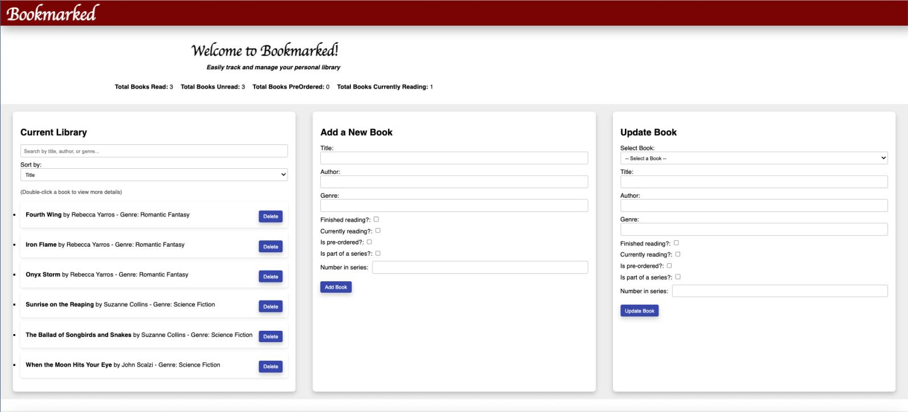
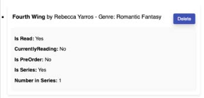

# Bookmarked — Full-Stack Book Tracking Application

Bookmarked is a full-stack web application I developed as an Arizona State
University CSE 412 Database Management final project.

The application was designed to help users track books they have read, are
currently reading, have pre-ordered, or plan to read while maintaining summary
statistics directly from the underlying database.

I developed the project across the frontend, backend, and database layers.

## Project Overview

The project required the development of a complete full-stack application that
integrated a relational database, backend, and frontend while demonstrating
CRUD operations and an advanced database concept.

I chose to build a personal book-tracking application because I wanted a simple
way to keep track of books I had read, had not yet read, or had pre-ordered.

## Technologies

### Frontend
- React
- JavaScript
- HTML
- CSS

### Backend
- Python
- Flask
- REST-style HTTP requests

### Database
- SQLite
- SQL
- Relational database design
- Row-level database triggers

## Application Features

Bookmarked allows users to:

- view their current book library
- add new books
- update existing book information
- delete books
- search and sort the library
- track whether a book has been read
- track books currently being read
- track pre-orders
- track series information
- view automatically updated read/unread totals

## Application Interface

The main interface combines the current library with forms for adding and
updating books.

### Book Details

Users can expand individual books to view additional information such as read
status, current-reading status, pre-order status, and series information.

### Adding Books

The Add Book workflow validates required fields before inserting a new record
into the database.

### Updating Books

Users can select an existing book and update its stored attributes through the
React interface.

## Database Design

The application stores book data in a relational SQLite database.

Book records include information such as:

- title
- author
- genre
- read status
- currently-reading status
- pre-order status
- series status
- number in series

A separate counters structure tracks summary values such as the number of books
marked as read and unread.

## Database Triggers

One of the primary database-focused features of the project was the use of
row-level triggers.

I implemented triggers that execute after:

- `INSERT`
- `UPDATE`
- `DELETE`

These triggers automatically keep the read and unread counters synchronized
with changes to book records.

For example:

- adding a read book increases the read total
- adding an unread book increases the unread total
- deleting a book decreases the appropriate total
- changing a book from unread to read updates both counters
- changing a book from read to unread updates both counters

This allowed summary values displayed by the frontend to remain synchronized
with the underlying database without requiring the UI to calculate those totals
independently.

## Data Integrity

The project also incorporated database and application-level safeguards to
support data integrity.

These included:

- required-field constraints for core book information
- input validation before database operations
- transaction handling for data-modification operations
- rollback behavior when database operations failed
- commits after successful inserts, updates, and deletes

## Full-Stack Interaction

The React frontend communicates with the Flask backend to perform database
operations.

Typical workflows include:

1. a user performs an action in the React interface
2. the frontend sends the request to the Flask backend
3. the backend validates the request and interacts with SQLite
4. the database performs the requested operation
5. database triggers update dependent counter values when necessary
6. updated data is returned to the frontend for display

This project gave me experience connecting user-interface behavior directly to
backend API logic and relational database operations.

## What I Learned

Bookmarked strengthened my understanding of full-stack application development
with a particular focus on database behavior.

The project gave me hands-on experience with:

- relational database design
- CRUD operations
- transaction handling
- data validation
- database triggers
- integrating React with a Flask backend
- connecting backend logic to SQLite
- maintaining consistency between stored data and the user interface

## Source Code

The original source code remains private because this project was completed as
university coursework.

This public repository documents the application's functionality, architecture,
database behavior, and project outcomes without publishing the course solution.
